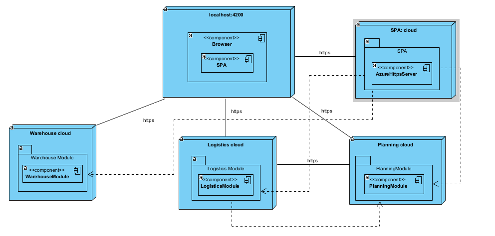
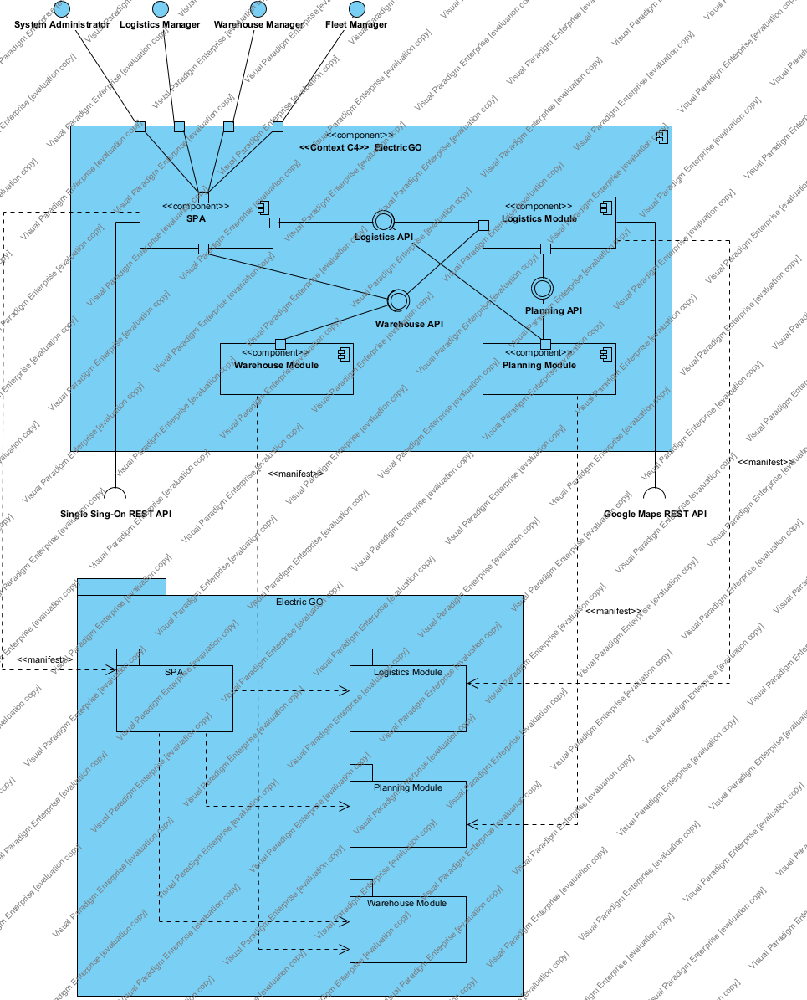
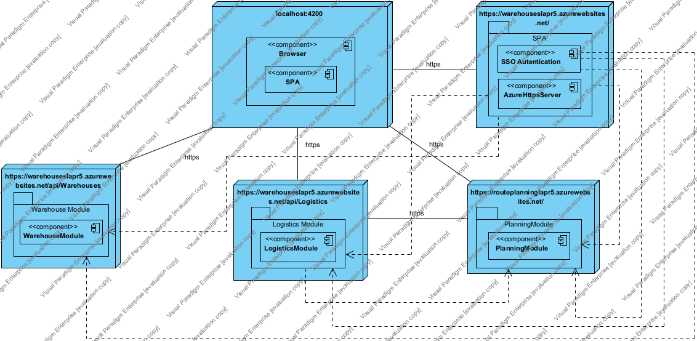
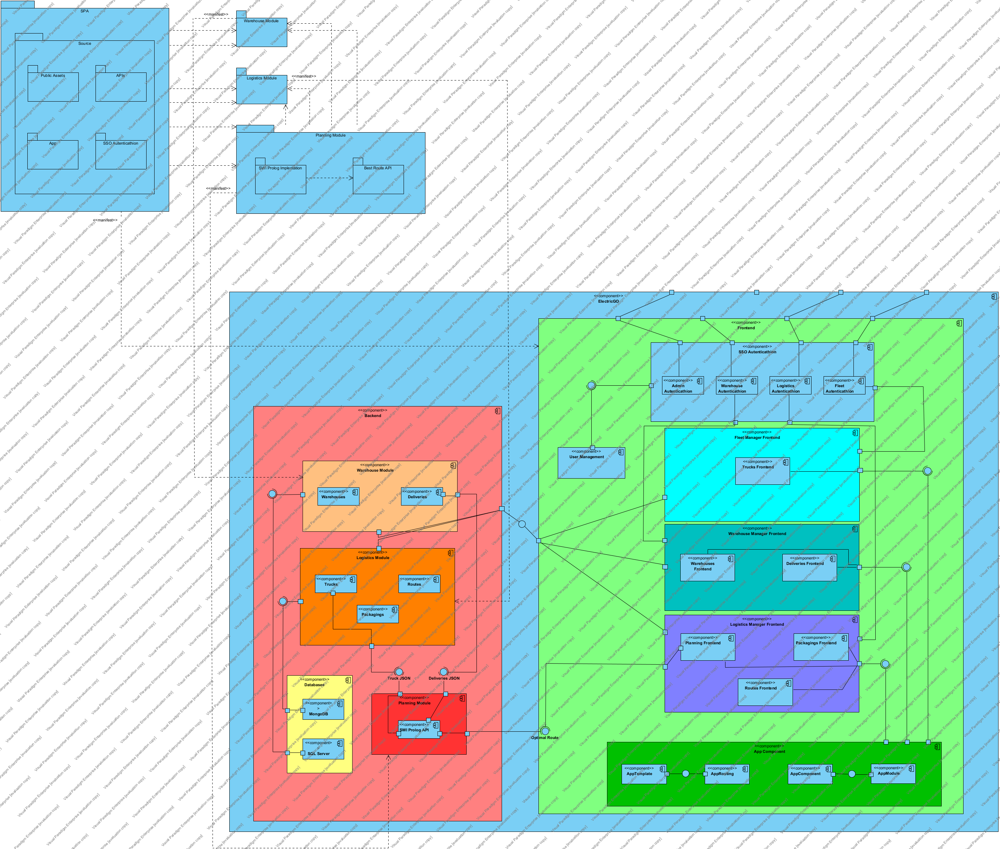

**Physical View <-> Logical View Level 2**

----

* This view is the mapping between the physical and the logical view in level 2

-----

**Implementation View <-> Logical View Level 2**

----

* This view is the mapping between the implementation and the logical view in level 2

-----

**Physical View <-> Logical View Level 3**

----

* This view is the mapping between the physical and the logical view in level 3

-----

**Implementation View <-> Logical View Level 3**

----

* This view is the mapping between the implementation and the logical view in level 2

-----

