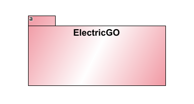

**Implementation View - Level 1**

----

* This view is the transition from the logical view of the system to the implementation view, which aims to demonstrate the packages, interfaces, and classes of the system, thus giving a more evident view of how the system is implemented. This level is too abstract, representing just the overall package.

-----

