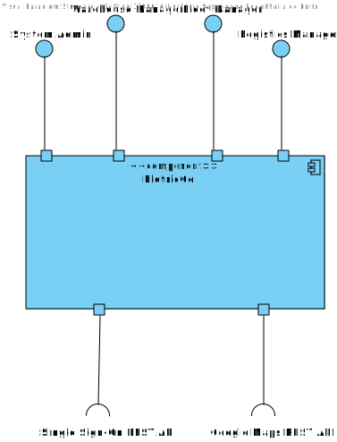

**Logical View - Level 1**

----

* The logical view (component diagram) is intended to give an overview of the structure and organization of the system architecture. This is level 1, which is a completely abstract view. At the levels above, we will be able to see a greater level of granularity.

-----

