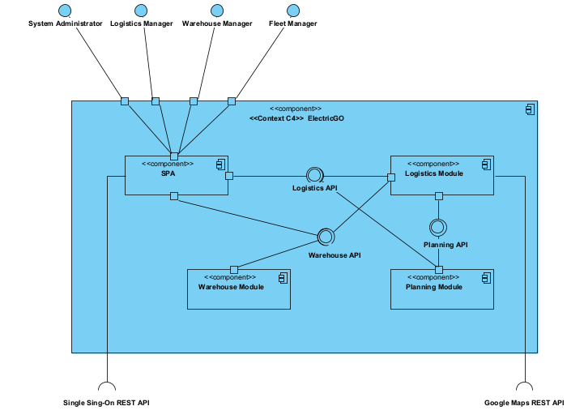

**Logical View - Level 2**

----

* The logical view (component diagram) is intended to give an overview of the structure and organization of the system architecture. This is level 2, which is a less abstract view than what we saw in level 1. In the level above, in level 3, we are going to see in detail the components of all the modules in the system.

-----

