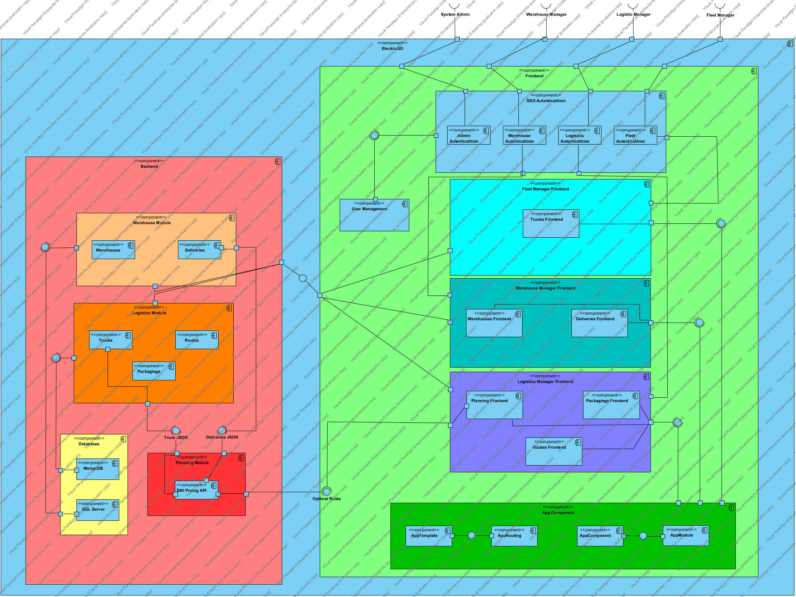

**Logical View Main - Level 3**

----

* The logical view (component diagram) is intended to give an overview of the structure and organization of the system architecture. This is level 3, which is the least abstract view of the three levels represented in this DAS.

-----

