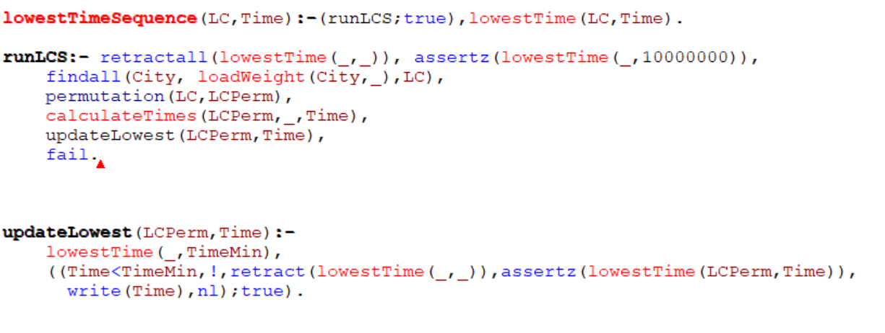

# ALGAV - Project Sprint B Report

* Ibon - 1220417
* Jakub - 1220419
* João Silva - 1200616
* Pedro Marques - 1191606
* Diogo Marques - 1190516

## USER STORIES

* US 3.2.3 - 1.a) The receiving data on deliveries to be made by 1 truck and on sections between warehouses: generating all possible trajectories through sequences of warehouses where deliveries must be made.
* US 3.2.3 - 1.b) Evaluate these trajectories according to the time to complete all deliveries and return to the Matosinhos base warehouse and choose the solution that allows the truck to return sooner.
* US 3.2.3 - 1.c) Increase the dimension of the problem (putting more warehouses to be visited) and verify to what extent it is feasible to proceed in the adopted way (with a generator of all the solutions) by carrying out a study of the complexity of the problem.
* US 3.2.3 - 1.d) Implement heuristics that can quickly generate a solution (not necessarily the best one) and evaluate the quality of these heuristics (for example, deliver to the nearest warehouse; then deliver with greater mass; combine distance for delivery with mass delivered).
* US 3.2.3 - 1.e) For a set of deliveries to be made, obtain a minor and a maximum of the time required to make the respective deliveries.

# Domain knowledge representation

Knowledge base for this project is adjusted to be taken from the database through REST Api. For testing the module and representing heuristics and review we used parser from json response text format that will be delivered as a response from Api and mocked facts in PROLOG format.

For testing part we take data from JSONs specified in the following facts:

It is read from files with use of streams and then written in the memory with the following code, where assertCompounds is a loop with assertz for all the facts:

In a knowledge base that for now is not imported from the database (will be in a future with use of e.g. flag isMainWarehouse) we have a fact with main warehouse, which will be begining and end of all trips:

### Truck

Following example is based on the assumption that we do not use more than one truck (which will be upgraded to many trucks in the next sprint):

Example of the fact regarding truck:

- Truck identification
- Weight of the truck
- Weight capacity of the truck
- Total batteries capacity
- Distance on single charge
- Time necessary to charge the truck between 20% and 80%

For making code cleaner we use helping functions to get the details about truck that we need to obtain at the moment:

- Weight of the truck
- Capacity of the truck
- Total possible weight of the truck (Weight + Capacity)
- Total energy that can be stored in batteries (kWh)
- Time to charge batteries from 20% to 80%

### Data Truck

Example of the facts regarding data truck:

- Identification of the truck
- Id of the warehouse on the beginning of the trip
- Id of the warehouse on the end of the trip
- Time necessary to accomplish the trip with full load
- Energy necessary to accomplish the trip with full load

Here as a helpers we use following code to take info about:

- Time between one and the other warehouse
- Added time for charging the batteries on the way
- Energy consumption on this distance

### Delivery

Example of the facts regarding deliveries:

- Identification of delivery
- Date of the delivery
- Weight that need to be delivered to warehouse
- Destination warehouse for the delivery
- Placement time for the delivery
- Pick up time for the delivery

Here as a helpers we use following code to take info about:

- Load weight that need to be delivered to the specific warehouse
- Total time necessary to do the pickup and unload the truck

# Optimal solution for Deliveries Planning with an electrical truck

We use following code to recursively calculate the sum of Weight needed to be transported during the road to each city:

Following code add weight of the truck to the previous calculations:

Following code calculate necessary time for driving, pick up and charging the truck combined:

It makes use of the helpers functions presented above to get weight of the truck, main warehouse city (which is added on the beginning and end of the list of cities), total battery capacity.

Then inside the calculateTimeInternal the time necessary for all the time necessary for transport between cities is calculated:

Inside this function we receive data from helpers about time needed for transport from first to second warehouse and total weight of the truck.
We use a multiplier calculated based on the ratio between loaded weight and total capacity. Following multiplier gives us the part of total value that we should consider for calculations.

For calculation of time necessary for charging batteries we calculate based on the following code:

We get from helper functions info about total weight of truck, bottom and top limits of battery level during transportation (20% and 80% respectively), energy needed for transport with full weight, added time for charging between warehouses and pickup time.

Our logic is based on assumption that during charging a truck we can also do the pick up. We take into calculations the time that takes longer to accomplish. Before each trip we check recursively if it is possible to accomplish the road without recharging batteries before departure.
We also take into account level to which we need to charge, if it is beginning of the trip we have more than a limit, and on the last trip it is necessary to charge truck to the extent that allow us to come back to warehouse with just 20% of batteries.

For calculating the best permutation of small list of given deliveries destination we use following code:

When it finds the permutation with smaller time necessary to accomplish the trip it save it into the memory and the previous lowest value is droped.

# Study of the problem complexity as well as the viability of finding the optimal solution by generating all the solutions

The problem has been scaled from 5 to 17 warehouses, using the table of ex deliveries 2, given in the Algav Moodle page. With with information it has been tried to solve the problem using the optimal solution method, explained before. Obtaining the next results:

The complexity of this problem is n!, because with a set of warehouses, every possible permutation is tried, meaning that for 5 warehouses there will be 120 possible permutations. This makes the time to generate a solution also increase exponentially, until the point where this solution cannot be applied anymore, having aproximated times like 20 hours for 12 warehouses(in theory, it can end being less or more). In the following image we can see the exponential time for searching a solution from 5 to 11 warehouses:

# Heuristics for the quick generation of solutions

To reduce the time for finding a solutions, three diferent heuristics will be tested:

1. Choosing first the nearest warehouses.

To calculate the time, first we select the order in which we are fullfilling the heuristic purpose, and then we calculate it as if it was one the permutations solved in the previous solution. This way instead of having n! permutations we have 1. For the first heuristic it is calculated the following way:

WIncial is the Warehouse where we start(usually 5, the main warehouse) and LC is a List of Cities, which we are going to reorganize into LCFinal with the heuristic.

We find all the times to go from the intial warehouse to the rest of them, and keep them in TimeList, then we chose the smallest one with smallestTimeHeuristic, delete it from the city list and turn it into the next initial warehouse, until we have created all the list, chosing each time the next warehouse using the heuristic.

2.Choosing first the warehouse with the heaviest delivery

The procedure is similar to the first one:

Instead of finding the distance, we now have to find a list of the remaining waregouse weights, we keep them in MassList. Then we repeat the process but with a diffrent heuristic. We chose the one with the biggest mass, we delete it from the list of remaining cities and add it to the new list(the permutation from which we will get the solution time).

3.A combination of the last two heuristics

This last heuristic is a combination of the last two. This means we have to chose based on the time to the warehouse an the weight of its delivery. To fullfill that we are chosing the warehouse with best (Time / Weight).

The code is a combination of the last two. We fins the Time/Weight for every remaining warehouse an keep them in TimeList, then we chose the smallest one, delte it from the city list, make it the new initial warehouse, and repeat until we have the perfect combination.

# Analysis of the heuristics quality

We tried the same tests we did for the optimal solution for the 3 heuristics. It is obvious that the time for the deliveries with the heuristics is much worse than with the optimal solution, but the ecreasing of the time needed to generate a solution is inmense. For example, with 12 warehouses we would be around 20 hours to get a solution, but with the heuristics is much less than a second. This is because the complexity of the problem now is much smaller. Although it still depends on the number of warehouses, with an exponential cost is too difficult to scale, so we had to chose the optimal solutions from the heuristics tests.

Comparing the different heuristics, the first one works well above the others for tests with a small number of warehouses, although it is much higher than the optimal.

The second one is not complete enough, and his time is much worst than the optimal, and even worst when dealing with more than 10 warehouses.

On the other hand, the third heuristic works better with a bigger number of warehouses, maybe because with more warehouses and more possibilities there can be more combinations of time and weight.

Even though they are not as good as the optimal solution, it is certain that we could find an heuristic that leads to a similar time than the optimal, not dealing with the exagerated amounts of time needed to find that solution.

# Minorants and Majorants of the time to produce a solution

We calulated the minorant and majorant time to make a delivery with 5-16 warehouses(and the Main Warehouse). Obtaining the next data, in relation with the previous solutions we had already calculated.

We can say that the solutions we calculated(both with the optimal solution and the heuristics) are quite good ones, as they are much more similar to the minorant than the majorant.

# Conclusions

To create a working optimal solution is very difficult. The better solutions we get, the bigger is the cost.

That is why the best way possible(at least in this project) to solve the problem is to find an heuristic that creates similar solutions to the optimal. This way the time is decreased significantly, and the solution is not affected in a bad way.

We also leart that for big problems it is contraproductive to try to solve it in an optimal way. Finding a good heuristic, that takes into account the most important parts of the problem is the best way to solve a problem like this, keeping a good scalability.
