# ALGAV - Project Sprint C Report

* Ibon Eito - 1220417
* Jakub Kielar - 1220419
* João Silva - 1200616
* Pedro Marques - 1191606
* Diogo Marques - 1190516

## USER STORIES

* As a logistics manager I want a solution to the problem using Genetic Algorithms
* As a client of the project, I intend to carry out a bibliographical study on the application of one of the following technologies to this problem: intelligent robotics; computer vision; automatic learning
* Once a delivery plan has been defined for a truck, adapt the plan to take into account dynamic changes

## 1) INTRODUCTION

We have managed to solve the problem of the electric trucks deliveries(similar to the famous problem of the backpack)
using the Genetic Algorithms showed in practical and theorical classes of Advanced Algorithms. Saprating this task in
several subtasks, all explained in this document.
We also managed to study how we could use machine learning to solve this
problem, explaing case its pros and cons.
Lastly(as we are a group of five or more) we prepared the algorithm to accept dynamic changes, such us adding or deleting
a delivery, or changing the weight of a delivery.

 

## 2) Creation of the initial population of the GeneticAlgorithm

We need four values to start with the genetic algorithm. The first thing we do is obtaining these values:
The number of generations, the dimension of the population of each generation, the probability of crossover
and the probability of mutation.
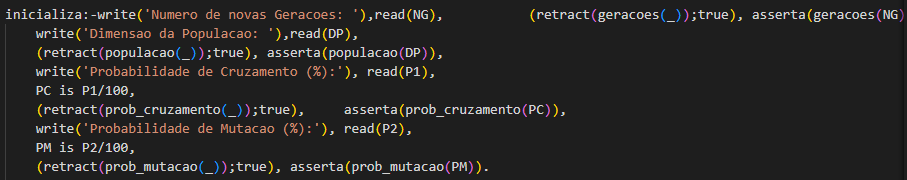

*Picture 1 - Code for initilization*

After getting these values we start with the genetic algorithm. For creating the initial population we use the
function gera_populacao(Pop)
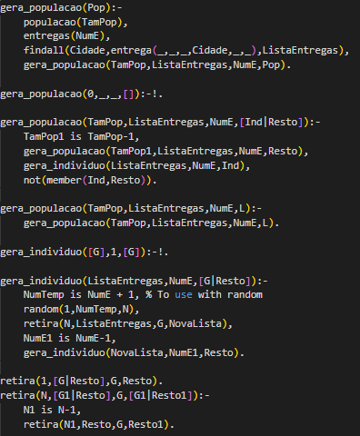

*Picture 2 - Code for generating a population(in this case the initial one)*

We find the list with all the deliveries given in the data and we create a population. Until we reach
the TamPop we generate one individual per iteracion. An individual is a list of genes created using random
numbers smaller each time.
For example, if we have 3 deliveries: Braga1, Gaia1 and Braga2, and we need 2 individuals for the initial generation.
For the first individual we get the random numbers of 2, 1 and 1, with the and for the second we get 3, 2 and 1.
Getting the population: [[Gaia1, Braga1, Braga1],[Braga2, Gaia1, Braga1]].

 

## 3) Random Crossover between individuals of the population

We make random crossovers between the individuals of the population so the sequences are not between the first and second, third and forth, etc.
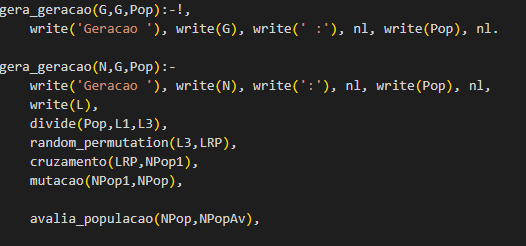
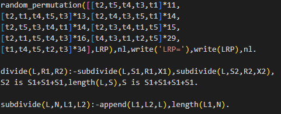

*Picture 3 - Code for permutation of individuals*

After that we have to add the crossover an the mutation(having into account the percetages given at the begining).
For that we use the functions *cruzamento* and *mutacao* respectivly.
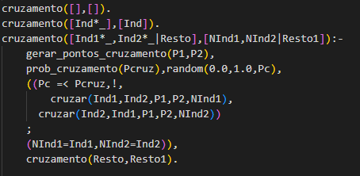

*Picture 4 - Code for crossovers*

We randomly choose if we have to apply the crossover or not depending on the percetage and in case we have we call the function *cruzar*.

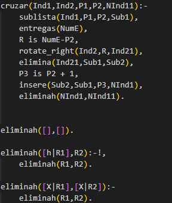

*Picture 5 - Code for cruzar*

We rotate one of the parents to the right in the index calculated before. The genes that are not rotated are passed to the children, while the rest are taken from the other parent.
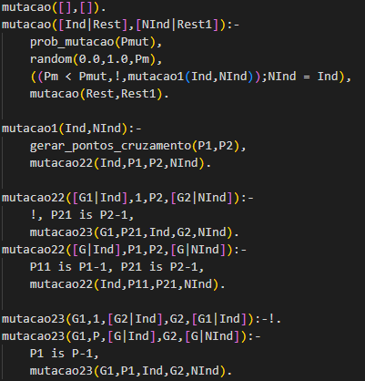

*Picture 6 - Code for mutation*

We use mutation to change some genes randomly to avoid the early convergence. If a mutation occurs we change the genes of a sequence of the chromosome to be different from the ones we had before.

 

## 4) Selection of the new generation of the population

 
To generate a new generation we take the 25% best individuals and pass it on to the next generation and we take the 75% best individuals and subject them to crossover and mutation.

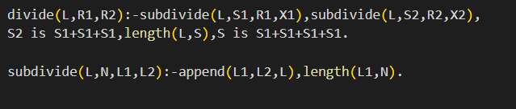

In order to account for the problem of mutating the best individual up to this point generated through crossing, we could compare the best individual from a new generation of descendents with the best individual from the previous generation, and if it was better, exclude it from the mutation and add it as it is.

## 5) Efficacy Analysis

We have compared the best individual created with the genetic algorithm with the results from the last sprint.
From 5 to 7 warehouses the initial data used is: 20(number of generations), 20(number of individuals), (probability of crossover) and 2%(probability of mutation), and from 8 to 11 warehouses we used 60 generations. Obtaining these results(we must have in mind that there is a part of probability in this algorithm so this might not be the best possible results, but the ones we have found):
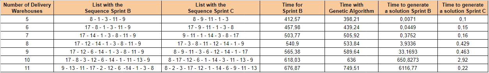

*Picture 7 - Table comparing last sprint with the GA*

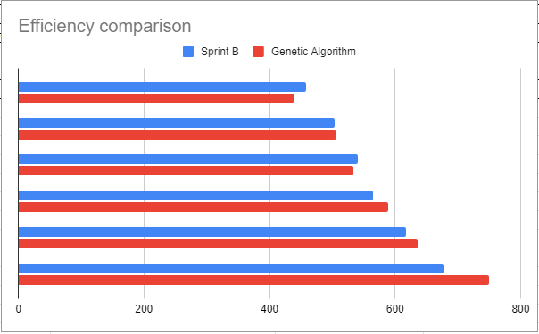

*Picture 8 - Graphical comparison of deliveries time last sprint with the GA*

The time of the solutions are very similar to the optimal ones, excepting the last one, which is much worst in the genetic algorithm. This might be because the initial data used was really small for the quantity of the problem(remember that there are almost 40 million solutions with 11 deliveries). In terms of time, the new algorithm is much efficient than the previous one, and the most important part is that it doesn't scale with the number of delivery warehouses, but with the number of generations and individuals.

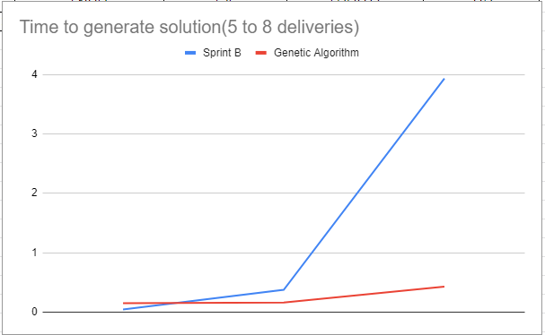

*Picture 9 - Graphical comparison of solution time last sprint with the GA*
 

## 6) Parametrization of the ending condition of the AG

 Only the number of generations chosen is the termining condition.

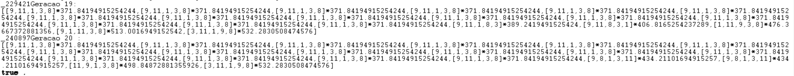
*Picture 10* 

A possible way we could implement a termining condition based on convergence of values could be (in the case of repeating values being allowed), checking if the first N elements of the ordered rated list of individuals are the same, in case there are no repeating individuals in the same population we should compare best values of the previous N generations.

## 7) Use of the GA to handle several trucks

To use GA for handling several trucks we created the function 'runForMany' which returns best possible route between cities and time necessary for trip of each truck.

*Picture 11 - runForMany code*  

*Picture 12 - runForMany results* 

This function returns two parameters as visible on Picture 12:
- List of trips, which have list of cities 
- List of times necessary to accomplish each trip

This function first take all of the trucks, which are available in the knowledge base and then call a function to divide all deliveries between trucks based on algorithm that tries to achieve certain balance of weight, distributing weight as equal as it is possible, without overcoming limits of trucks capacity at the same time.

*Picture 13 - algorithm that divides deliveries between truck to achieve certain balance of weight* 

As presented on Picture 13 algorithm takes first truck from the given list and tries to put all the deliveries to that truck.

If it is impossible then new truck is added to the list and algorithm sort all deliveries by weight in descending order and divide them between two trucks. Then deliveries are grouped based on truck Id into separate lists. 
If it is impossible to divide deliveries on two trucks the process is working recursively until it finds the right amount of trucks that can deliver all the deliveries.

After dividing all the deliveries, recursive function 'forEachTruck' that sorts deliveries order based on GA algorithm is called. 

*Picture 14 - function that finds best solution of all generated by GA algorithm*

Function given on the Picture 14 asserts values necessary to calculate GA for one truck and one trip. After that it saves the best solution for each truck inside GA algorithm and returns best route and time necessary for this route.

**Functions used are presented below:**

*Picture 15 - function used to add trucks one by one until there are no trucks left possible to add*

*Picture 16 - function that checks if the capacity limit of the truck is exceeded*

*Picture 17 - functions that add new trip and truck assertions for each execution of GA algorithm*

**Dynamic changes for group of 5 students**

As we are a group of 5 people, we also allowed the user to include dynamic changes after finishing the GA. We included 3 possible changes(but more could be easily added in the future): change the load of a delivery, add a delivery and delete a delivery. When the creation of the generations is finished, the program asks you if you want to make any last-minute change. In case you want you introduce the number 1 and it presents you with the possible dynamic changes to make. Lets see an example. You create a 20 generations of 20 individuals with 3% of crossover and 2% of mutation for 5 deliveries. After it generates all the generations and finishes, the program ask for changes, we accept it and want to add a delivery of 310 kilos to the warehouse 17. We add the needed data and it recalculates the problem taking into account the new change.
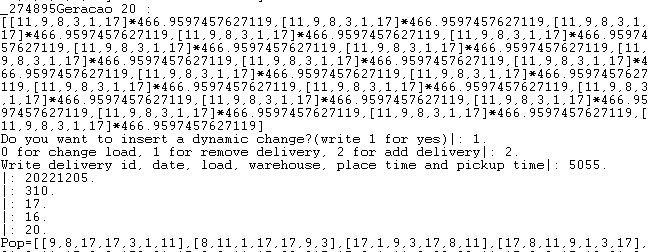
*Picture 18 - result of function that dynamically adds and remove deliveries from the list*
 

## 8) Study of method of Machine Learning applied to the problem

For this point we did a seperate report that was submitted in the same folder.  

## 9) Conclusion

In conclusion, genetic algorithms are really useful in this kind of problems. We can see how the best route construct itself as it is is evolving to be the best individual possible. It is really efficient in terms of time, but it has a random factor, so some generations can lead to worst result, with their children following the parentes and so on. But if we manage to find a good generation by try and error, at the end this algorithm is more useful than the previous ones.
