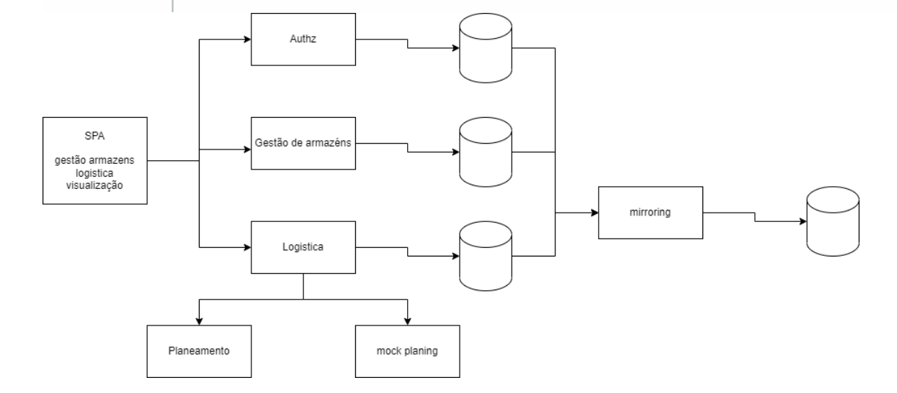

# ISEP-LAPR5-2022/2223

**Repository for the LAPR5 integrative project.**

------------------------------------------------

### System Overview

-----------------------

## User Stories:

| Sprint |  Module                | US's                                                                  | Description        | Subject |
|--------|------------------------|-----------------------------------------------------------------------|--------------------|---------|
| **A**  | Warehouse Management   | [USA01](/Docs/SprintA/USA01/USA01.md)                                 |                    | ARQSI   |
| **A**  | Warehouse Management   | [USA02](/Docs/SprintA/USA02/USA02.md)                                 |                    | ARQSI   |
| **A**  | Warehouse Management   | [USA03](/Docs/SprintA/USA03/USA03.md)                                 |                    | ARQSI   |
| **A**  | Warehouse Management   | [USA04](/Docs/SprintA/USA04/USA04.md)                                 |                    | ARQSI   |
| **A**  | Logistics              | [USA05](/Docs/SprintA/USA05/USA05.md)                                 |                    | ARQSI   |
| **A**  | Logistics              | [USA07](/Docs/SprintA/USA07/USA07.md)                                 |                    | ARQSI   |
| **A**  | Logistics              | [USA08](/Docs/SprintA/USA08/USA08.md)                                 |                    | ARQSI   |
| **A**  | Warehouse Management   | [USA09](/Docs/SprintA/USA09/USA09.md)                                 |                    | ARQSI   |
| **A**  | Warehouse Management   | [USA10](/Docs/SprintA/USA10/USA10.md)                                 |                    | ARQSI   |
| **A**  | Warehouse Management   | [USA11](/Docs/SprintA/USA11/USA11.md)                                 |                    | ARQSI   |
| **A**  | Warehouse Management   | [USA12](/Docs/SprintA/USA12/USA12.md)                                 |                    | ARQSI   |
| **A**  | Logistics              | [USA13](/Docs/SprintA/USA13/USA13.md)                                 |                    | ARQSI   |
| **A**  | Logistics              | [USA14](/Docs/SprintA/USA14/USA14.md)                                 |                    | ARQSI   |
| **A**  | Logistics              | [USA15](/Docs/SprintA/USA15/USA15.md)                                 |                    | ARQSI   |
| **A**  | Logistics              | [USA16](/Docs/SprintA/USA16/USA16.md)                                 |                    | ARQSI   |
| **A**  | Logistics              | [USA17](/Docs/SprintA/USA17/USA17.md)                                 |                    | ARQSI   |
| **A**  | Logistics              | [USA18](/Docs/SprintA/USA18/USA18.md)                                 |                    | ARQSI   |
| **A**  | Logistics              | [USA19](/Docs/SprintA/USA19/USA19.md)                                 |                    | ARQSI   |
| **A**  | Logistics              | [USA20](/Docs/SprintA/USA20/USA20.md)                                 |                    | ARQSI   |
| **B**  | SPA                    | [US 3.2.1 - 1.a](/Docs/SprintB/US3.2.1-1.a/US3.2.1-1.a.md)            | Create Warehouse   | ARQSI   |
| **B**  | SPA                    | [US 3.2.1 - 1.c](/Docs/SprintB/US3.2.1-1.c/US3.2.1-1.c.md)            | List Warehouses    | ARQSI   |
| **B**  | SPA                    | [US 3.2.1 - 1.b](/Docs/SprintB/US3.2.1-1.b/US3.2.1-1.b.md)            | Create Delivery    | ARQSI   |
| **B**  | SPA                    | [US 3.2.1 - 1.d](/Docs/SprintB/US3.2.1-1.d/US3.2.1-1.d.md)            | List Deliveries    | ARQSI   |
| **B**  | SPA                    | [US 3.2.1 - 2.a](/Docs/SprintB/US3.2.1-2.a/US3.2.1-2.a.md)            | Create Truck       | ARQSI   |
| **B**  | SPA                    | [US 3.2.1 - 2.f](/Docs/SprintB/US3.2.1-2.f/US3.2.1-2.f.md)            | List Trucks        | ARQSI   |
| **B**  | SPA                    | [US 3.2.1 - 2.b](/Docs/SprintB/US3.2.1-2.b/US3.2.1-2.b.md)            | Create Route       | ARQSI   |
| **B**  | SPA                    | [US 3.2.1 - 2.g](/Docs/SprintB/US3.2.1-2.g/US3.2.1-2.g.md)            | List Routes        | ARQSI   |
| **B**  | SPA                    | [US 3.2.1 - 2.c](/Docs/SprintB/US3.2.1-2.c/US3.2.1-2.c.md)            | Create Packaging   | ARQSI   |
| **B**  | SPA                    | [US 3.2.1 - 2.d](/Docs/SprintB/US3.2.1-2.d/US3.2.1-2.d.md)            | List Packagings    | ARQSI   |
| **B**  | SPA                    | [US 3.2.1 - 2.1.c](/Docs/SprintB/US3.2.1-2.1.c/US3.2.1-2.1.c.md)      | List Route Planning | ARQSI   |
| **B**  | SPA                    | [US 3.2.1 - 3.a](/Docs/SprintB/US3.2.1-3.a/US3.2.1-3.a.md)            |                    | SGRAI   |
| **B**  | SPA                    | [US 3.2.1 - 3.b](/Docs/SprintB/US3.2.1-3.b/US3.2.1-3.b.md)            |                    | SGRAI   |
| **B**  | SPA                    | [US 3.2.1 - 3.c](/Docs/SprintB/US3.2.1-3.c/US3.2.1-3.c.md)            |                    | SGRAI   |
| **B**  | Logistics              | [US 3.2.2 - 1.a.1](/Docs/SprintB/USA3.2.2-1.a.1/US3.2.2-1.a.1.md)     | Create Route Planning | ARQSI   |
| **B**  | Planning               | [US 3.2.3 - 1.a](/Docs/SprintB/US3.2.3-1.a/US3.2.3-1.a.md)            |                    | ALGAV   |
| **B**  | Planning               | [US 3.2.3 - 1.b](/Docs/SprintB/US3.2.3-1.b/US3.2.3-1.b.md)            |                    | ALGAV   |
| **B**  | Planning               | [US 3.2.3 - 1.c](/Docs/SprintB/US3.2.3-1.c/US3.2.3-1.c.md)            |                    | ALGAV   |
| **B**  | Planning               | [US 3.2.3 - 1.d](/Docs/SprintB/US3.2.3-1.d/US3.2.3-1.d.md)            |                    | ALGAV   |
| **B**  | Planning               | [US 3.2.3 - 1.e](/Docs/SprintB/US3.2.3-1.e/US3.2.3-1.e.md)            |                    | ALGAV   |
| **B**  | Infrastructure         | [US 3.2.4 - 1](/Docs/SprintB/US3.2.4-1/US3.2.4-1.md)                  |                    | ARQSI   |
| **B**  | Infrastructure         | [US 3.2.4 - 2](/Docs/SprintB/US3.2.4-2/US3.2.4-2.md)                  |                    | ARQSI   |
| **B**  | Infrastructure         | [US 3.2.4 - 3](/Docs/SprintB/US3.2.4-3/US3.2.4-3.md)                  |                    | ASIST   |
| **B**  | Infrastructure         | [US 3.2.4 - 4](/Docs/SprintB/US3.2.4-4/US3.2.4-4.md)                  |                    | ASIST   |
| **B**  | Infrastructure         | [US 3.2.4 - 5](/Docs/SprintB/US3.2.4-5/US3.2.4-5.md)                  |                    | ASIST   |
| **B**  | Infrastructure         | [US 3.2.4 - 6](/Docs/SprintB/US3.2.4-6/US3.2.4-6.md)                  |                    | ASIST   |
| **B**  | Infrastructure         | [US 3.2.4 - 7](/Docs/SprintB/US3.2.4-7/US3.2.4-7.md)                  |                    | ASIST   |
| **C**  | SPA                    | [US 3.3.1 - 1.a](/Docs/SprintC/US3.3.1-1.a/US3.3.1-1.a.md)            | Create User Acc    | LAPR    |
| **C**  | SPA                    | [US 3.3.1 - 1.b](/Docs/SprintC/US3.3.1-1.b/US3.3.1-1.b.md)            | Cancel User Acc    | LAPR    |
| **C**  | SPA                    | [US 3.3.1 - 4](/Docs/SprintC/US3.3.1-4/US3.3.1-4.md)                  | RGPD               | LAPR    |
| **C**  | SPA                    | [US 3.3.1 - 1.c](/Docs/SprintC/US3.3.1-1.c/US3.3.1-1.c.md)            | SSO                | ARQSI   |
| **C**  | SPA                    | [US 3.3.1 - 2.a](/Docs/SprintC/US3.3.1-2.a/US3.3.1-2.a.md)            | List Planning Many | ARQSI   |
| **C**  | SPA                    | [US 4.a](/Docs/SprintC/US4.a/US4.a.md)                                | Filter & Order Trips | ARQSI   |
| **C**  | SPA & Logistics        | [US 4.b](/Docs/SprintC/US4.b/US4.b.md)                                | List & Page Trips  | ARQSI   |
| **C**  | SPA & Logistics        | [US 4.c](/Docs/SprintC/US4.c/US4.c.md)                                | List & Page Routes | ARQSI   |
| **C**  | SPA                    | [US 4.d](/Docs/SprintC/US4.d/US4.d.md)                                | Filter & Order Packagings | ARQSI   |
| **C**  | SPA & Logistics        | [US 4.e](/Docs/SprintC/US4.e/US4.e.md)                                | List & Page Packagings    | ARQSI   |
| **C**  | SPA & Warehouse Management | [US 4.f](/Docs/SprintC/US4.f/US4.f.md)                            | Inhibit Warehouse  | ARQSI   |
| **C**  | SPA & Logistics        | [US 4.g](/Docs/SprintC/US4.g/US4.g.md)                                | Inhibit Truck      | ARQSI   |
| **C**  | Logistics              | [US 3.3.2 - 1.a](/Docs/SprintC/US3.3.2-1.a/US3.3.2-1.a.md)            | Fleet Planning     | ARQSI   |
| **C**  | Logistics              | [US 3.3.2 - 1.b](/Docs/SprintC/US3.3.2-1.b/US3.3.2-1.b.md)            | Fleet Planning OCP | ARQSI   |
| **B+C**  | SPA                    | [US 3.2.1 - 1.a!](/Docs/SprintC/US3.2.1-1.a!/US3.2.1-1.a!.md)            | Create Warehouse + SSO   | ARQSI   |
| **B+C**  | SPA                    | [US 3.2.1 - 1.c!](/Docs/SprintC/US3.2.1-1.c!/US3.2.1-1.c!.md)            | List Warehouses + SSO   | ARQSI   |
| **B+C**  | SPA                    | [US 3.2.1 - 1.b!](/Docs/SprintC/US3.2.1-1.b!/US3.2.1-1.b!.md)            | Create Delivery + SSO   | ARQSI   |
| **B+C**  | SPA                    | [US 3.2.1 - 1.d!](/Docs/SprintC/US3.2.1-1.d!/US3.2.1-1.d!.md)            | List Deliveries  + SSO  | ARQSI   |
| **B+C**  | SPA                    | [US 3.2.1 - 2.a!](/Docs/SprintC/US3.2.1-2.a!/US3.2.1-2.a!.md)            | Create Truck + SSO      | ARQSI   |
| **B+C**  | SPA                    | [US 3.2.1 - 2.f!](/Docs/SprintC/US3.2.1-2.f!/US3.2.1-2.f!.md)            | List Trucks + SSO       | ARQSI   |
| **B+C**  | SPA                    | [US 3.2.1 - 2.b!](/Docs/SprintC/US3.2.1-2.b!/US3.2.1-2.b!.md)            | Create Route + SSO      | ARQSI   |
| **B+C**  | SPA                    | [US 3.2.1 - 2.g!](/Docs/SprintC/US3.2.1-2.g!/US3.2.1-2.g!.md)            | List Routes + SSO       | ARQSI   |
| **B+C**  | SPA                    | [US 3.2.1 - 2.c!](/Docs/SprintC/US3.2.1-2.c!/US3.2.1-2.c!.md)            | Create Packaging + SSO  | ARQSI   |
| **B+C**  | SPA                    | [US 3.2.1 - 2.d!](/Docs/SprintC/US3.2.1-2.d!/US3.2.1-2.d!.md)            | List Packagings + SSO   | ARQSI   |
| **B+C**  | SPA                    | [US 3.2.1 - 2.1.c!](/Docs/SprintC/US3.2.1-2.1.c!/US3.2.1-2.1.c!.md)      | List Route Planning + SSO | ARQSI  |
| **B+C**  | Logistics              | [US 3.2.2 - 1.a.1!](/Docs/SprintC/USA3.2.2-1.a.1!/US3.2.2-1.a.1!.md)     | Create Route Planning + SSO | ARQSI   |
| **C**  | Infrastructure         | [US 3.3.4 - 2](/Docs/SprintC/US3.3.4-2/US3.3.4-2.md)                  |                    | ASIST   |
| **C**  | Infrastructure         | [US 3.3.4 - 3](/Docs/SprintC/US3.3.4-3/US3.3.4-3.md)                  |                    | ASIST   |
| **C**  | Infrastructure         | [US 3.3.4 - 4](/Docs/SprintC/US3.3.4-4/US3.3.4-4.md)                  |                    | ASIST   |
| **C**  | Infrastructure         | [US 3.3.4 - 6](/Docs/SprintC/US3.3.4-6/US3.3.4-6.md)                  |                    | ASIST   |
| **C**  | Infrastructure         | [US 3.3.4 - 7](/Docs/SprintC/US3.3.4-7/US3.3.4-7.md)                  |                    | ASIST   |
| **C**  | Infrastructure         | [US 3.2.4 - 8](/Docs/SprintC/US3.3.4-8/US3.3.4-8.md)                  |                    | ASIST   |
| **C**  | Infrastructure         | [US 3.2.4 - 10](/Docs/SprintC/US3.3.4-10/US3.3.4-10.md)               |                    | ASIST   |
| **C**  | Infrastructure         | [US 3.2.4 - 11](/Docs/SprintC/US3.3.4-11/US3.3.4-11.md)               |                    | ASIST   |
| **C**  | SPA                    | [US 3.3.1 - 3.a](/Docs/SprintC/US3.3.1-3.a/US3.3.1-3.a.md)            |                    | SGRAI   |
| **C**  | SPA                    | [US 3.3.1 - 3.b](/Docs/SprintC/US3.3.1-3.b/US3.3.1-3.b.md)            |                    | SGRAI   |
| **C**  | SPA                    | [US 3.3.1 - 3.d](/Docs/SprintC/US3.3.1-3.d/US3.3.1-3.d.md)            |                    | SGRAI   |
| **C**  | SPA                    | [US 3.3.1 - 3.e](/Docs/SprintC/US3.3.1-3.e/US3.3.1-3.e.md)            |                    | SGRAI   |
| **C**  | Planning               | [US 3.3.3 - 1](/Docs/SprintC/US3.3.3-1/US3.3.3-1.md)                  |                    | ALGAV   |
| **C**  | Planning               | [US 3.3.3 - 2](/Docs/SprintC/US3.3.3-2/US3.3.3-2.md)                  |                    | ALGAV   |
| **C**  | Planning               | [US 3.3.3 - 3](/Docs/SprintC/US3.3.3-3/US3.3.3-3.md)                  |                    | ALGAV   |
| **C**  | Planning               | [US 3.3.3 - 4](/Docs/SprintC/US3.3.3-4/US3.3.3-4.md)                  |                    | ALGAV   |

------------------------------------------------------

## Views (Level 1, 2, 3)

- [Views](#views)
	- **Level 1**
		- [Logical View](./Docs/Views/ViewsLevel1/LV1.md)
		- [Physical View](./Docs/Views/ViewsLevel1/PV1.md)
        - [Implementation View](./Docs/Views/ViewsLevel1/IV1.md)
	- **Level 2**
        - [Logical View](./Docs/Views/ViewsLevel2/LV2.md)
		- [Physical View](./Docs/Views/ViewsLevel2/PV2.md)
        - [Implementation View](./Docs/Views/ViewsLevel2/IV2.md)
	- **Level 3**
		- [Logical View - LogisticModule](./Docs/Views/ViewsLevel3/LV3_Logistic.md)
		- [Logical View - WarehouseModule](./Docs/Views/ViewsLevel3/LV3_Warehouse.md)
		- [Logical View - Main](./Docs/Views/ViewsLevel3/LV3_Main.md)
		- [Physical View](./Docs/Views/ViewsLevel3/PV3.md)
        - [Implementation View - LogisticModule](./Docs/Views/ViewsLevel3/IV3_Logistic.md)
		- [Implementation View - WarehouseModule](./Docs/Views/ViewsLevel3/IV3_Warehouse.md)
		- [Implementation View - SSO](./Docs/Views/ViewsLevel3/IV3_SSO.md)
		- [Implementation View - Main](./Docs/Views/ViewsLevel3/IV3_Main.md)
		

--------------------------------------------------------

# Models & Views

A combination of two architectural representation models was adopted: C4 and 4+1.

The 4+1 View Model proposes the description of the system through complementary views, thus allowing to analyze separately the requirements of the various stakeholders of the software, such as users, system administrators, project managers, architects and programmers. The views are thus defined as follows:

- Logical view: relating to aspects of the software aimed at responding to business challenges;
- Process view: relative to the flow of processes or interactions in the system;
- Implementation view: relative to the organization of the software in its development environment;
- Physical view: relating to the mapping of the various software components into hardware, i.e. where the software runs;
- Scenario view: relating to the association of business processes with actors capable of triggering them.

The C4 Model defends the description of software through four levels of abstraction: system, container, component and code. Each level adopts a finer granularity than the level before it, thus giving access to more detail in a smaller part of the system.

The levels are defined as follows:
- Level 1: Description (framework) of the system as a whole;
- Level 2: Description of system containers;
- Level 3: Description of container components;
- Level 4: Description of the code or smaller parts of the components (and as such, will not be covered in this DAS/SAD).

It can be said that these two models expand along different axes, with the C4 model presenting the system with different levels of detail and the 4+1 View Model presenting the system from different perspectives. By combining the two models, it becomes possible to represent the system from different perspectives, each with different levels of detail.

To visually model/represent both what was implemented and the ideas and alternatives considered, we used the Unified Modeling Language (UML).

-------------------------------------------------

### Domain Model

------------------------------------------------

# Architecture Background

An architecture based on Onion was used, as it is the easiest to increase in the future, as the system evolves or there is a need to do so.

--------------------

### **Design Constraints**

---------------------

### **Implementation constraints**

-------------------------

### **Interface constraints**

--------------------------------

### **Physical constraints**

------------------

# Glossary and Acronyms

* **DDD** - Domain Driver Design
* **DTO** - Data Transfer Object
* **API** - Application Programming Interface
* **PV** - Physical View
* **LV** - Logical View
* **IV** - Implementation View

-------------

## References

-----------------------